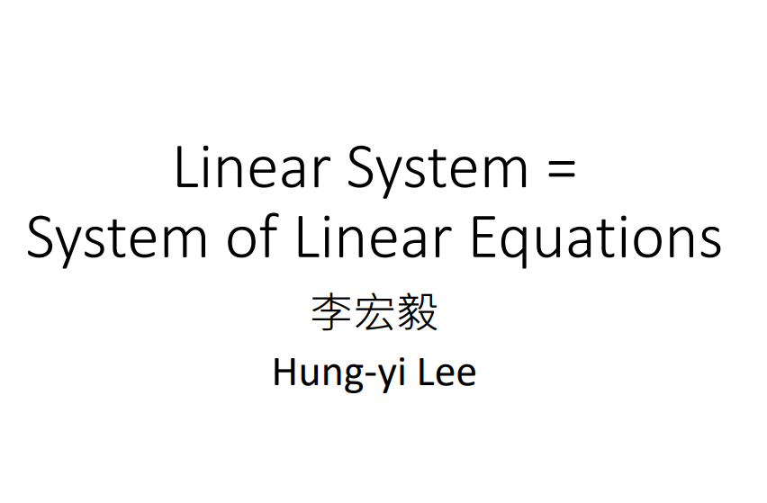
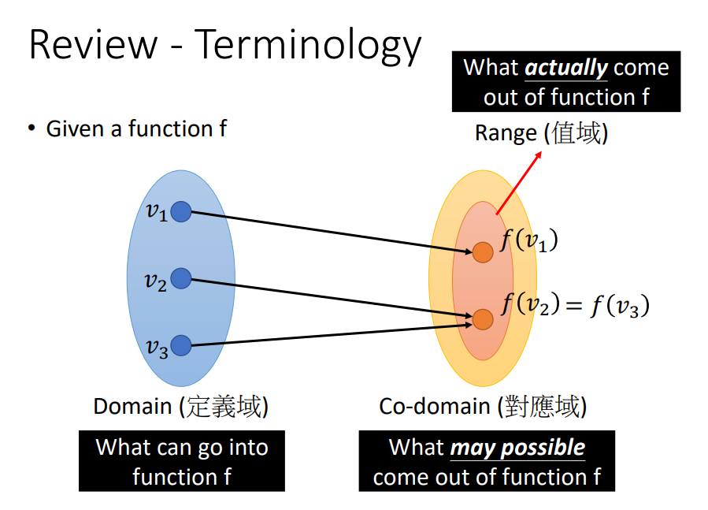
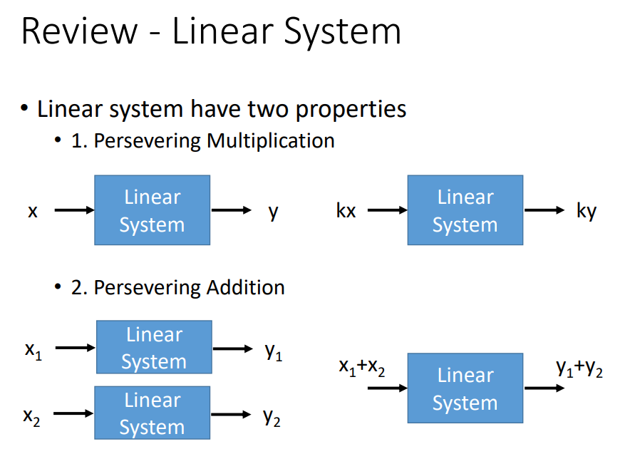
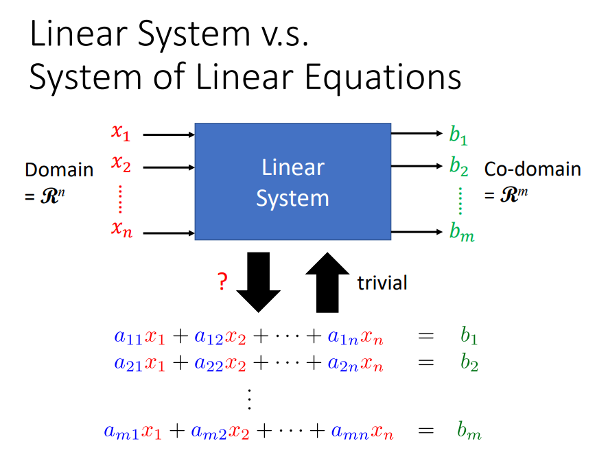
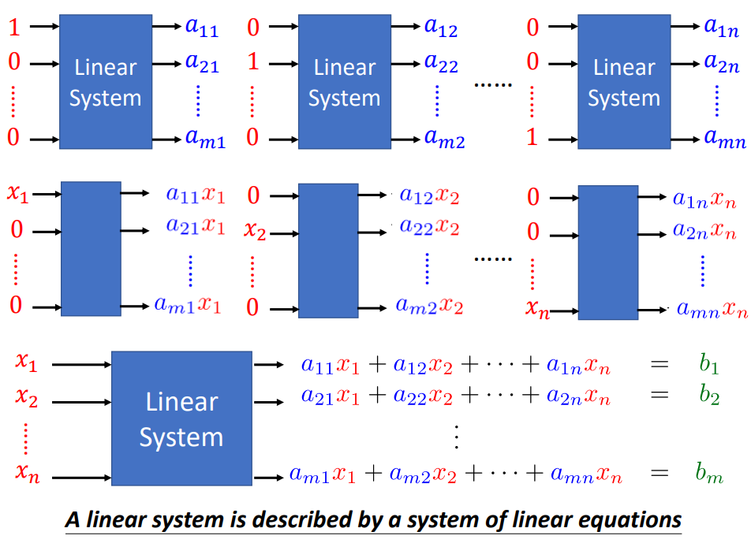

上节课讲了线性代数就是在分析线性的系统，你可能觉得线性的系统听起来很陌生，也许你过去没有听过线性系统。但是Linear System有另外的表示的方式，这个表示的方式你一定知道，英文叫做System of Linear Equations。

## 多元一次联立方程式

我们先来讲什么是System of Linear Equations，英文表示你可能一下子想不起来是什么，它的中文是“多元一次联立方程式”。

你可能常常需要解这个问题：有一个方程式是`$2x_1+3x_2+5x_3=5$`，其中`$x_1,x_2,x_3$`叫做variables，`$2, 3, 5$`叫做coefficients，等号右边的5是一个constant term。像这样`$2x_1+3x_2+5x_3=5$`的多元一次方程式之前是学习过的。那我们如果有一大堆的多元一次方程式，我们就得到了多元一次联立式接下来的问题就是，给你这些多元一次联立方程式(System of linear equations)，你是否能够把`$x_1,x_2,x_3$`找出来，我相信你一定知道咋样做。

 
我们可以把刚才多元一次联立方程式(System of linear equations)写的更加的general一点，更通用的写法。这个写法里面有n个variables(`$x_1,...x_n$`)，总共有m个equations，每一个equations都有一个constant term(`$b_1,b_2,...b_m$`)。在m个equations里面每一个variables都有一个coefficient。

如果在第一个equation里面的第一个variable(`$x_1$`)的coefficient写做`$a_{11}$`，第一个equation里面的第二个variable(`$x_2$`)的coefficient写做`$a_{12}$`，依次类推，System of linear equations的General形式可以写成上述表达的形式。在这门课里面，m跟n的数目是很大，之前在学习的时候m，n通常都是3。在这门课里面我们要讨论的是m跟n比较大的时候应该咋样处理。

## 术语
### 定义域
### 值域

在讲System of linear equations之前，我们先来讲Terminology。如果我们有一个function f ，function f会有一个定义域(Domain)，定义域的意思是说：所以可以当做这个f input的集合。function f的输出都会落在对应域(Co-domain)：function
f可能出现的output所成的集合。值域(Range)意思是说：function 真正可以输出结果的集合。

同学们比较困惑点是：Co-domain跟Range有什么样的不同，所先值域比对应域还要小，值域一定是被对应域包含在里面。

举例来说：有一个很简单的function($y=x^2$)，它的定义域是R(real number)，对应域是：你不假思索的觉得这个output是什么，不要分析这个function的内涵。$y=x^2$的输入是实数(real number)，输出y显然也一定是实数(real number)。但是你仔细思考了这个function的内涵以后，会发现$y=x^2$中y一定大于等于0，那么值域其实只包含了0跟所有的正数，所以值域是比所有的real number还要小(positive real number, 0)。

### 一对一
### 映成

接下来还要讲两个名词：一个是“one-to-one”(一对一)，一个是Onto(映成)。

one-to-one(一对一)的意思是：现在所有在domain里面的variable丢到function里面，得到一个在Co-domain里面的输出，这些输出都是不一样的。也就是说没有两个input有一样的output。

另外一个名词叫做Onto(映成)，当你的range等于Co-domain时叫做Onto。你先不假思索的定义出了Co-domain以后，发现function的output其实是涵盖整个Co-domain，Co-domain里面的每一个
==()==function都可以output出来，这个时候你的Co-domain等于range。

不管是在one-to-one还是Onto，range一定比Co-domain还要小。在one-to-one的时候，我们不知道Co-domain跟range一样大还是小，但是我们知道domain跟range是一样大。一样大是一个很模糊的概念，之后我们会讲的更清楚两个Set一样大是什么意思。因为domain里面可能会有无穷多个element，这个range里面也有无穷多个element。但是domain跟range之间的关系是一对一的，每一个在domain里面的element都有一个在range里的element，显然domain跟range一样大。Onto这个function根据它的定义，Co-domain跟range一样大。

## 线性系统

Linear System有两个properties，第一个properties：一个function有一个input x 一个output y，一个linear System的意思是：我们如果把输入乘以k倍，输出也会乘以k倍。第二个properties：如果我们输入$x_1$输出$y_1$，输入$x_2$输出$y_2$，那输出$x_1+x_2$输出是$y_1+y_2$

在讲Linear System之前，为了要知道大家是不是真的了解linear Systme的概念，因为很多人对Linear System的想象就是有一个条直线是斜的就叫做linear System，其实不是这样的。现在举两个function看是不是linear Systme。

输入一个function f，Derivative可以吃另外一个function当做input(Derivative是一个function)，会输出另外一个function f'(输入function f的微分)。会做微分(Derivative)的function是不是linear System，接下来举一个更加具体的例子。假设输入的function是$x^2$，输出的function是输入function做微分的结果$2x$。输入是一个曲线，输出是一条直线，显然要把曲线压成直线显然是一个很复杂的process，但它是linear System(微分感觉很复杂，但它确实是线性系统)。

有一个function的工作是做积分，然后吃一个function当做输入，会输出一个数值(把输入的function f从a积分到b得到一个数值，这个数值是这个会做积分function的输出)。假设输入是$x^2$，输出是把function f从a积分到b($\frac{1}{3}(b^3-a^3)$)，积分这件事情也是也是线性的。

## 线性系统和线性方程组
 

假设有一个线性的系统(在这门课里面，通常分析线性系统的时候，假设输入是一个向量)，这个linear System的输入是一个n维的向量，输出是一个m维向量。input domain是所有n维向量的集合，Co-domain是所有m维向量的集合。你可能会觉得这样输入向量会不会很局限呢？后面的课程会告诉你，事实上这个世界上很多事情都是向量，所以这个分析非常的general，可以apply非常多的地方。

这个linear system可以写成System of linear equations，反过来讲比较容易，如果你把一个System of linear equations中的variable(x)当做input，将b当做system的constant term(output)，那这个System of linear equations显然是一个linear system。因为你只要把这些输入都乘以k倍，输出会显然乘以k倍，所以它符合线性系统的第一个特性。第二个特性是theorem，不需要证明。可以很容易看出一个System of linear equations是linear System。

但是反过来讲，一个linear system一定可以写成System of linear equations吗？这是下一个投影片要讲的内容。

### 线性方程组

这篇投影片要讲的是一个linear System一定可以写成System of linear equations，接下来假设你知道咋样分析System of linear equations，你就知道咋样分析linear system。接下来你要说明一个linear system为什么对应有一个System of linear equations。

现在有一个linear system(黑盒子)，对linear system输入一个standard vector(1,0,...0)，这个向量只有第一维是1其它维度都是0，它给出一组输出$a_{11},a_{21},...a_{n1}$。输入另外一组向量(0,1,...0)，会产生$a_{12},a_{22},...,a_{m2}$，直到输入一组向量(0,0, ...1)，产生$a_{1n},a_{2n},...,a_{mn}$。假设输入了n个standard vector以后，就可以得到n个输出。

根据线性系统的特性，如果你把输入乘以k倍，输出就会乘以k倍。所以现在给输入乘以$x_1$倍，输出也直接乘以$x_1$倍。本来输入(1,0,...0)，输出$a_{11},a_{21},...,a_{m1}$，输入输出都乘以$x_1$后，输入变为$x_1,0,...0$，输出变为$a_{11}x_1,a_{21}x_1,...,a_{m1}x_1$，这是线性系统的第一个特性(input乘以k倍，output乘以k被)。如果将线性系统的输入通通加起来会等于输出加起来，也就是：($x_1,0,..0$)，($x_2,0,..0$)，一直到($0,0,...x_n$)加起来，得到的向量是($x_1,x_2,...x_n$)，输出应该是原来没有相加式子的总和。假设输出第一维是$b_1$，第二维是$b_2$，第m维是$b_m$。我们又知道第一维的输出是($a_{11}x_1+a_{12}x_2+...+a_{1n}x_n$)，等于$b_1$。第二维的输出是($a_{21}x_1+a_{22}x_2+...+a_{2n}x_n$，等于$b_2$。所以它其实是一个System of linear equations。

今天投影片学到的是：linear system一定可以System of linear equations，之后在分析System of linear equations时，就是在分析的是linear system。