之前已经讲了线性系统是System of Linear Equations，System of Linear Equations可以表示为matrix跟vector相乘。接下来的问题是：我们咋样知道System of Linear Equations有解还是无解。

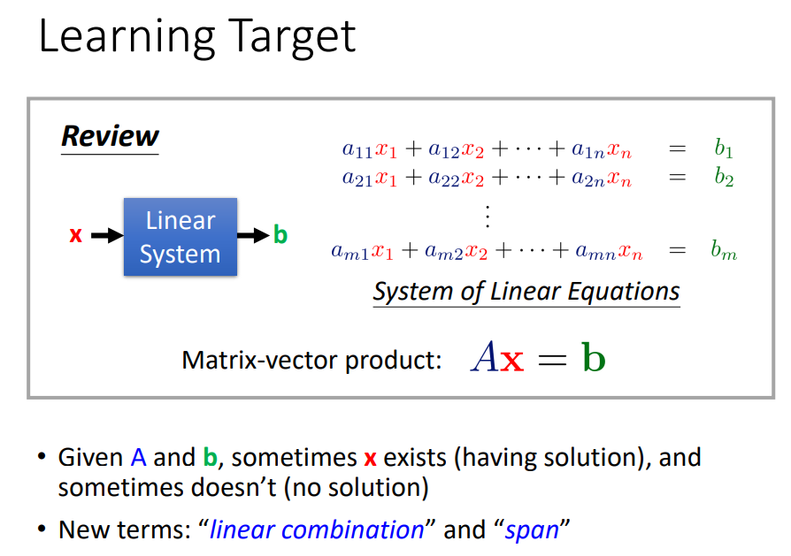

我们已经System of Linear Equations跟Matrix-vector product是同一件事情。接下来要讨论的是：一个线性的系统是否有解。

假设给定A和b，接下来你要去检测在给定A跟b的前提下，x是否存在(是否能找得到一个x跟A相乘以后得到的结果是b)。或者说：System of Linear Equations所有的coefficient A，跟constant term，是否能够找到一组x，使得equations成立。在这次课中会学到连个专业词汇，一个是linear combination，第二个是span。

有没有解这个问题非常的重要，你可以假设linear system是你的电路，现在老板指定这个电路输出数值b的电流，那自己能不能找到合适的电压源和电流源，使得输出是老板指定的输出值。

## 解

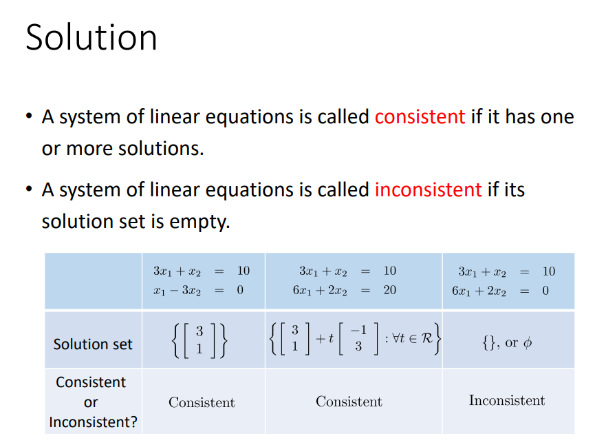

如果一个System of Linear Equations有解，不管是有一个解或者更多的解，那我们说这个System of Linear Equations是consistent。如果的解是空集合时，那我们称这个System of Linear Equations叫做inconsistent。

$\begin{matrix}
3x_1+x_2=10\\ 
x_1-3x_2=0
\end{matrix}$只有唯一解为$\begin{bmatrix}
3\\ 
1
\end{bmatrix}$；$\begin{matrix}
3x_1+x_2=10\\ 
6x_1+2x_2=1
\end{matrix}$的解为$\begin{bmatrix}
3\\ 
1
\end{bmatrix}+t\begin{bmatrix}
-1\\ 
3
\end{bmatrix}$，其中t为任何实数，解都是成立的。$\begin{matrix}
3x_1+x_2=10\\ 
6x_1+2x_2=0
\end{matrix}$的解为空集合。所以第一个System of Linear Equations是constant，第一个System of Linear Equations也是constant，第三个System of Linear Equations是inconstant

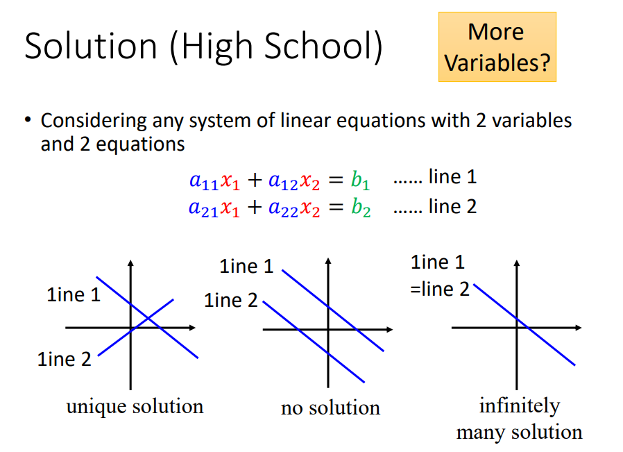

检查System of Linear Equations这件事在高中的时候也学过，你可能解过这样的问题，给定一个二元一次联立方程式$\begin{matrix}
a_{11}x_1+a_{12}x_2=b_1\\ 
a_{21}x_1+a_{22}x_2=b_2
\end{matrix}$，第一条Equations是一条直线($x_1$可以当做x轴，$x_2$当做是y轴)，第二条Equations也是一条直线，将两条直线画在图中。如果这两条直线只有唯一的交点，那这个System of Linear Equations就是唯一解；如果这两条直线是平行的，那这个System of Linear Equations就是无解；如果这两条直线正好重合，那就有无穷多解。

在高中的时候是解有两个变量的方程式，你可以画在二维的平面上，解三个变量可以画在三维的空间中。你可能没有试着解过更高维的问题，在线性代数这门课里面，我们就是要解更高维的问题。

## linear combination

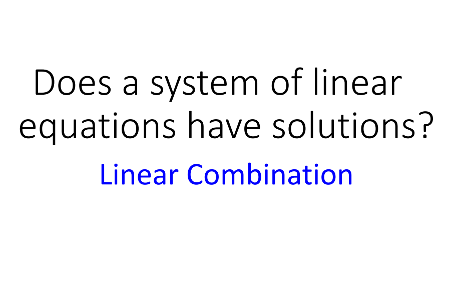

首先要讲的观念是linear combination。

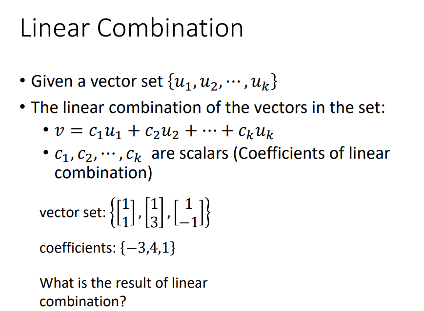

给定一组vector set{$u_1,u_2,...u_k$}，你可以对这个给定的vector set做linear combination。指定k个scalars，称作coefficient of linear combination，然后将k个vector跟k个数值相乘，得到一个新的vector v($v=c_1u_1+c_2u_2+,...,c_ku_k$)。

假定一组vector set为{$\begin{bmatrix}
1\\ 
1
\end{bmatrix}，\begin{bmatrix}
1\\ 
3
\end{bmatrix}，\begin{bmatrix}
1\\ 
-1
\end{bmatrix}$}，给定coefficient为{$-3,4,1$}。coefficient跟vector set做linear combination的结果为$\begin{bmatrix}
2\\ 
8
\end{bmatrix}$。

### 列的角度

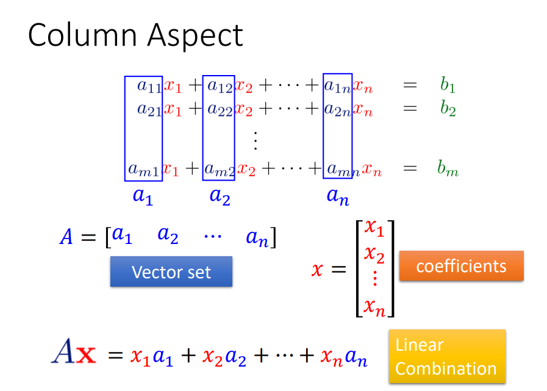

linear combination跟有没有解有什么关系呢，事实上之前讲matrix跟vector相乘时，已经讲过linear combination。其实矩阵跟向量相乘，就是将矩阵的每一个column做linear combination。

将所有的coefficient集合在一起当做matrix来看待(对应相同variable的coefficient集合就是每一个column)，将矩阵A跟向量x相乘，得到的结果其实就是将($a_1,a_2,...a_n$)和($x_1,x_2,...,x_n$)做linear combination。matrix跟vector相乘就是将matrix的column做linear combination。

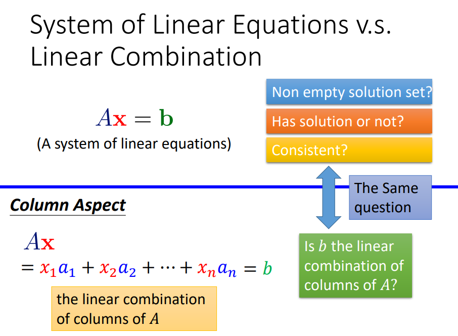

我们今天要讨论的问题是Ax=b有没有解，等同于solution set是否为empty，等同于这个linear combination是否为consistent。也等同于b是否为A的column linear combination

### 示例1

给定的linear combination($\begin{matrix}
3x_1+6x_2=3\\ 
2x_1+4x_2=4
\end{matrix}$)可以写做为矩阵($A=\begin{bmatrix}
3 &6 \\ 
2 &4 
\end{bmatrix}$)跟向量($\begin{bmatrix}
x_1\\ 
x_2
\end{bmatrix}$)相乘，得到的结果为($\begin{bmatrix}
3\\ 
4
\end{bmatrix}$)。

接下来的问题是b是否为A的column($\begin{bmatrix}
3\\ 
2
\end{bmatrix},\begin{bmatrix}
6\\ 
4
\end{bmatrix}$)，b是否为这两个column的linear combination。

接下来用图示的方法来解决这个问题，将vector set($\begin{bmatrix}
3\\ 
2
\end{bmatrix},\begin{bmatrix}
6\\ 
4
\end{bmatrix}$)描述在二维的平面上(未来要解更高维问题的时候，你没有办法将它画在二维的平面上，我们在这里先讨论低维的事情)。如果你用任何的coefficient和($\begin{bmatrix}
3\\ 
2
\end{bmatrix},\begin{bmatrix}
6\\ 
4
\end{bmatrix}$)做linear combination，linear combination的结果一定落在这条虚线上。

如果$\begin{bmatrix}
3\\ 
4
\end{bmatrix}$并没有落在这条虚线上，那它就不是($\begin{bmatrix}
3\\ 
2
\end{bmatrix},\begin{bmatrix}
6\\ 
4
\end{bmatrix}$)的linear combination，所以这个System of Linear Equations是没有解。

### 示例2

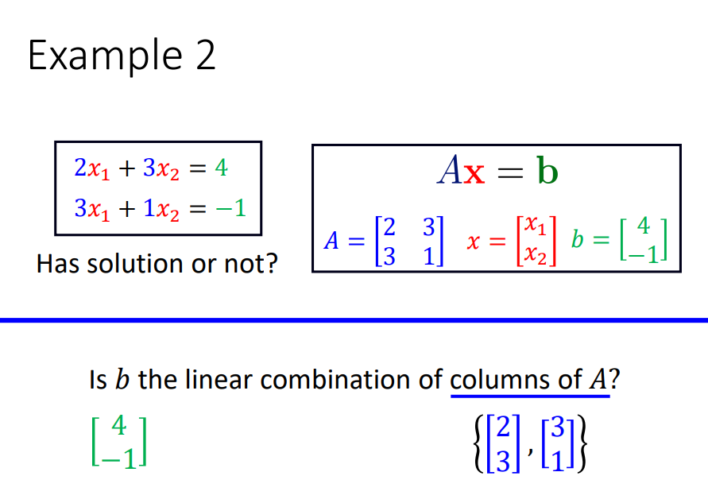

这个System of Linear Equations($\begin{matrix}
2x_1+3x_2=4\\ 
3x_1+1x_2=-1
\end{matrix}$)是否有解，有解这个陈述等同于columns($\begin{bmatrix}
2\\ 
3
\end{bmatrix},\begin{bmatrix}
3\\ 
1
\end{bmatrix}$)做linear combination能不能产生($\begin{bmatrix}
4\\ 
-1
\end{bmatrix}$)。

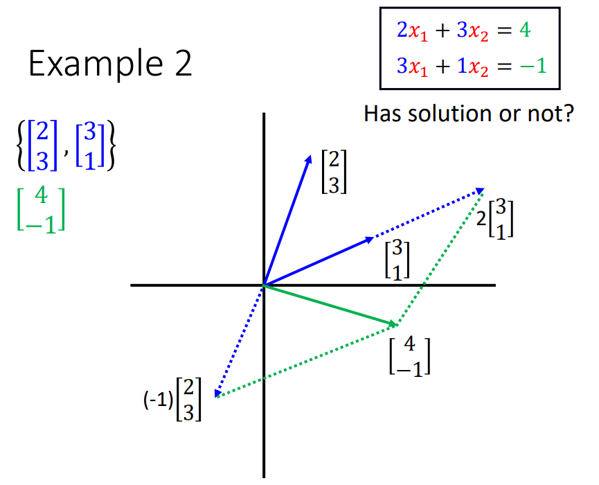

将在图中描述($\begin{bmatrix}
2\\ 
3
\end{bmatrix},\begin{bmatrix}
3\\ 
1
\end{bmatrix}$)，vector$\begin{bmatrix}
4\\ 
-1
\end{bmatrix}$是否可以用($\begin{bmatrix}
2\\ 
3
\end{bmatrix},\begin{bmatrix}
3\\ 
1
\end{bmatrix}$)进行linear combination得到呢？这个是可以得到。将$\begin{bmatrix}
3\\ 
1
\end{bmatrix}$乘以2，$\begin{bmatrix}
2\\ 
3
\end{bmatrix}$乘以(-1)，然后将其进行相加得到结果为$\begin{bmatrix}
4\\ 
-1
\end{bmatrix}$。所以b是A的linear combination，这个System of Linear Equations是有解的。

如果vector u和v为互不平行的二维向量，那它们的linear combination就是整个二维空间。这就告诉我们：假设给定System of Linear Equations，matrix A中的两个vector(u,v)不是平行的，那这个System of Linear Equations不管右边的b值是什么，一定是有解的。

现在很清楚的知道在二维空间中两个非平行的vector进行linear 表示任何的vector，那我们推广至三维的空间。在三维空间中有u、v、w互不平行的三条向量，u、v、w三条互不平行的向量进行linear combination之后是不能表示三维空间中的任何一个vector。所以是不是平行来决定一组vector是否能表示整个空间的向量是不够的，所以会在下面的投影片提一个independent的概念。

我门刚才学到在二维平面中u，v非平行，就一定有解；反过来看：有解是否能保证u，v非平行，这是不成立的。

### 示例三

接下来我们举个例子来描述它是为什么不成立的，matrix A为$\begin{bmatrix}
2 &6 \\ 
1 &3 
\end{bmatrix}$，b$\begin{bmatrix}
-4\\ 
-2
\end{bmatrix}$。然后我们问它有没有解，意思就是说：matrix A的columns做linear combination后有没有可能得到b

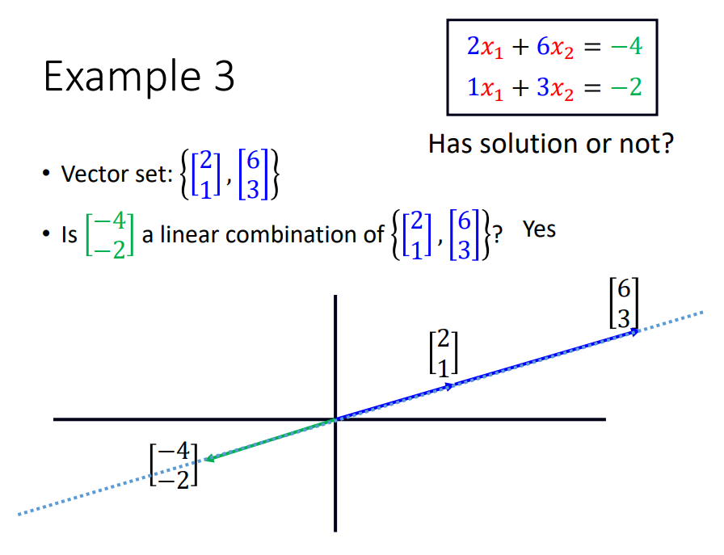

那我们就把matrix A的cloumns在二维的空间中做出来($\begin{bmatrix}
2\\ 
1
\end{bmatrix},\begin{bmatrix}
6\\ 
3
\end{bmatrix}$做linear combination以后有没有可能得到$\begin{bmatrix}
-4\\ 
-2
\end{bmatrix}$)，$\begin{bmatrix}
2\\ 
1
\end{bmatrix},\begin{bmatrix}
6\\ 
3
\end{bmatrix}$做linear combination以后所得到的vector一定落在跟他们平行的这条虚线上，$\begin{bmatrix}
-4\\ 
-2
\end{bmatrix}$正好落在这条虚线上，所以它是有解的。如果$\begin{bmatrix}
-4\\ 
-2
\end{bmatrix}$没有落在这条虚线上，它就是没有解的。

如果u和v是非平行的(column的两个vector)一定有解，一定有解不能证明它是非平行的。

## Span

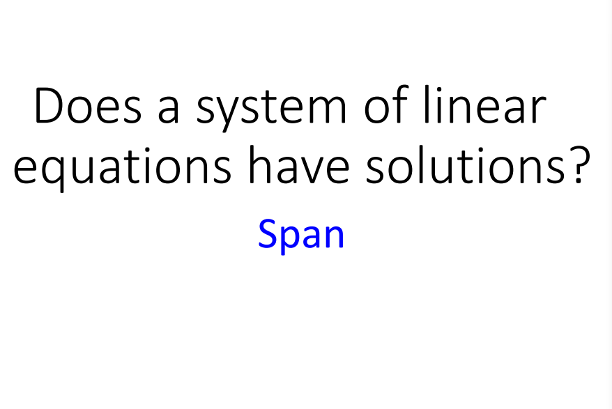

接下来要讲的一个观念是：Span

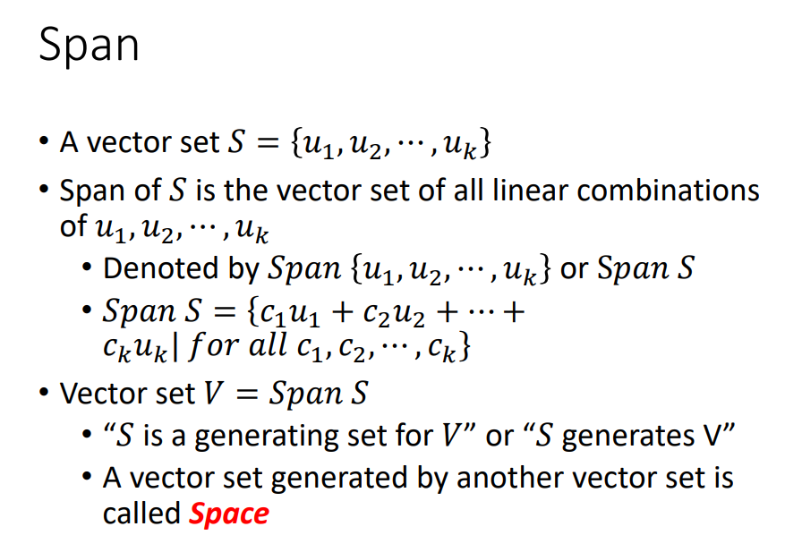

有一个vector Set S=($u_1,u_2,...u_k$)，将$u_1,u_2,...u_k$做linear combination后，将linear combination可能得到的vector集合起来叫做这个vector Span(穷举所有的coefficients就可以组成各式各样的vector，你将所有组出的vector都集合起来得到一个很大的集合，这个很大的集合写做Span S)

加入有一个vector Set V正好等于Span S，我们就称vector set S是vector Set V的generating set，或者我们说：S generates V，我们可以将S当做是描述V的一个特性的方法。

V是很大的vector，通常有无穷多个element，所以如果要描述它时，没有办法将里面的element都列举出来。所以如果要描述有无穷多个element的vector set时，你就可以用generates set来描述它具有咋样的特性。

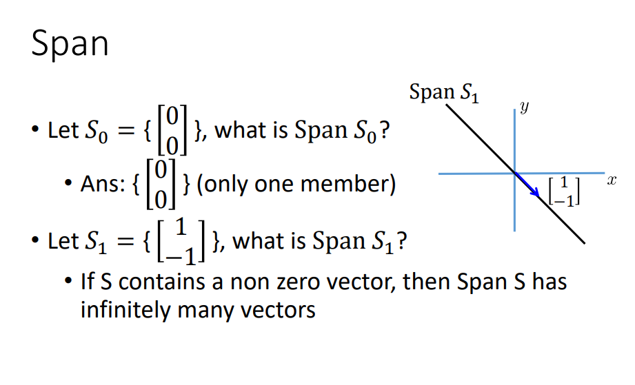

现在有一个vector $S_0$($\begin{bmatrix}
0\\ 
0
\end{bmatrix}$)，将这个vector$S_0$做Span后，得到新的vector也只有一个member(0乘以任何的coefficients$c_1$是0)，所以进行Span之后并不是永远得到无穷多个element

现在有vector$S_1$($\begin{bmatrix}
1\\ 
-1
\end{bmatrix}$)，$S_1$进行Span以后，得到的结果是这一条黑色直线上任何的vector，这条黑色上的任何vector都可以用vector($\begin{bmatrix}
1\\ 
-1
\end{bmatrix}$)乘以coefficient$c_1$得到。所以将$S_1$进行Span以后，得到新的vector是在这条直线上面所有vector的集合。

如果在一个vector set里面有非零的vector，若将这个vector set进行Span以后会有无穷多的vector

更多的示例：将vecctor($\begin{bmatrix}
1\\ 
-1
\end{bmatrix}$)进行Span以后，得到的vector set是这条黑色的直线。现在将vector($\begin{bmatrix}
1\\ 
-1
\end{bmatrix},\begin{bmatrix}
-2\\ 
2
\end{bmatrix}$)进行Span以后($\begin{bmatrix}
1\\ 
-1
\end{bmatrix}$乘以各种不同的$c_1$，$\begin{bmatrix}
2\\ 
-2
\end{bmatrix}$乘以各种不同的$c_2$)，得到的结果也会落在同一条黑色的直线上。

这个示例告诉我们Span $S_1$=Span $S_2$，所以就算是两个vector set里面的vector数目不同，两者都进行Span以后仍然有可能得到相同的vector set。

将vector set$S_3$，现在将$S_3$进行Span之后得到的Span $S_3$是整个二维空间中所有向量的集合($Span S_3=R^2$)

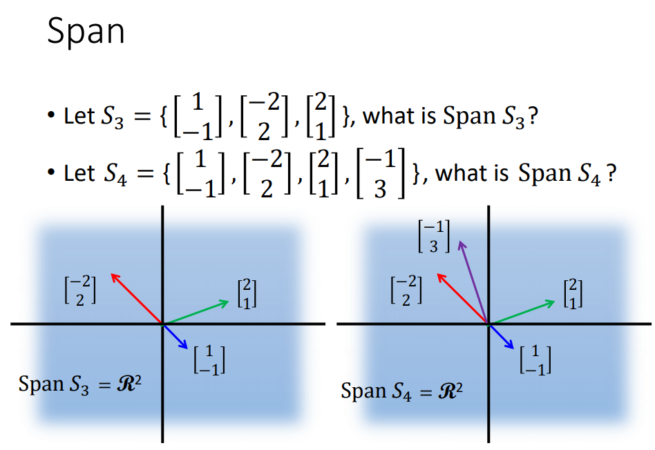

若vector set多加一个vector·=$\begin{bmatrix}
-1\\ 
3
\end{bmatrix}$，Span$S_4=R^2$。接下来不管你多加多少个vector，得到的结果仍然都是 $R^2$

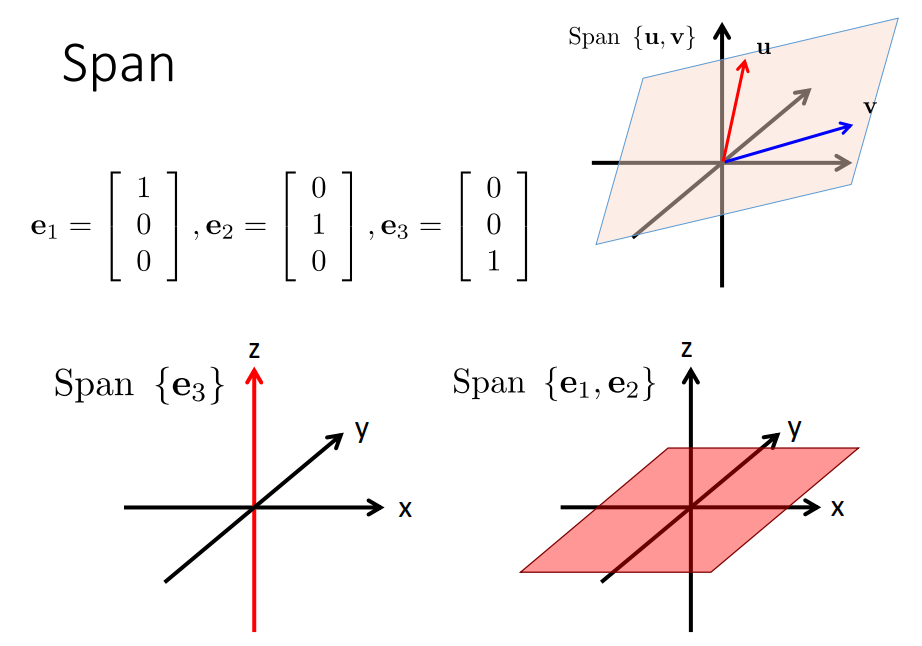

standard vector是其中一维是1，都是都为0。假设对e_2$进行Span之后，得到的结果是所有落在z轴上的vector；若将$e_1,e_2$进行Span之后，得到的结果是x,y整个平面；若将$e_1,e_2,e_3$进行Span之后，得到的结果是整个三维的空间。

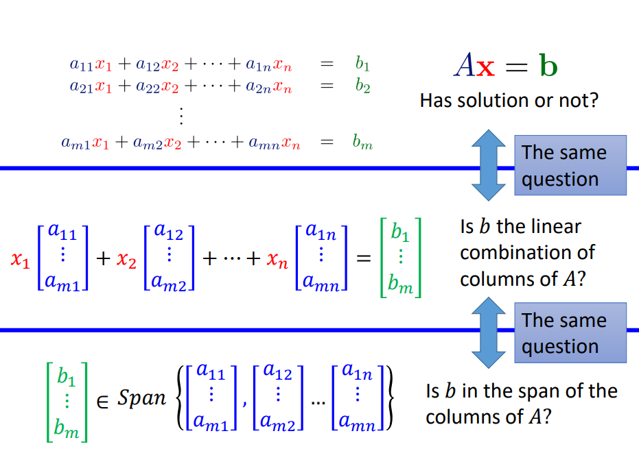

有了Span的概念后，我们刚才的陈述：有没有解这个问题就可以换一种陈述。有没有解等于：b是不是A的linear combination，也等于b是不是在A的cloumns 的Span里面(A的column所成的集合进行Span之后得到新的vector set V，b如果在V里，就代表这个linear equation是有解的；若没有就代表无解)

## 总结

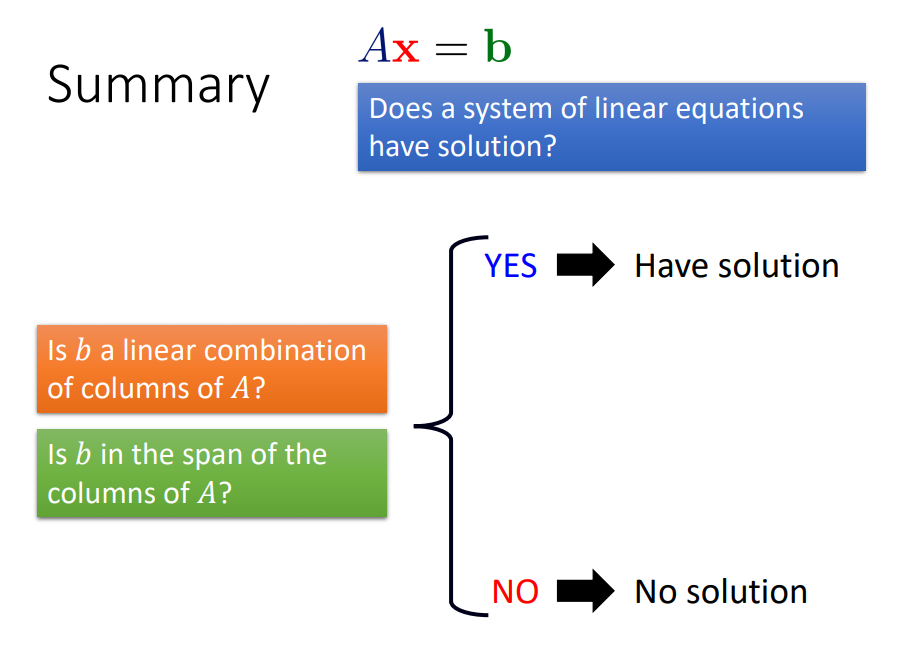

检验一个linear equations有没有解等同于b是不是A的column的linear combination；等同于b是不是在A的column进行Span之后所形成的vector set里面

