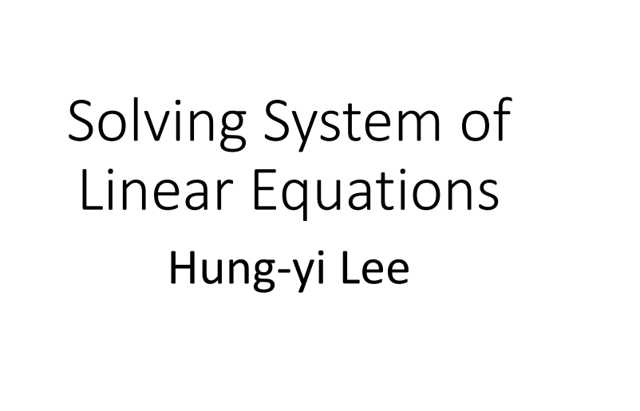

前面几节课的内容我们讲述了linear equation有没有解、有多少解，只是做了专业名词的定义，没有说明有什么演算法可以直接操作就知道有解还是没有解。今天要讲的内容是：按照高斯消去法进行操作就可以知道有解还是无解。

## 前人计算线性方程组书籍
### 九章算术

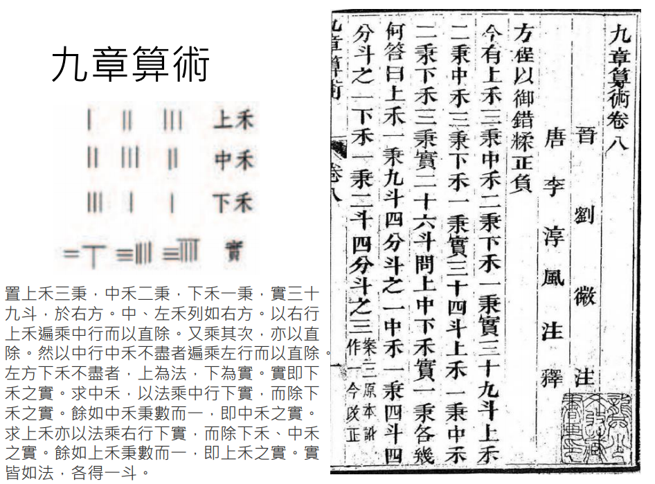

最早出现高斯消去法是在《九章算术》(汉朝)的第八章的方程章，此章投影片展示的是其中的习题。

### 算法统宗

在明代有另外一本书叫做《算法统宗》，通过编歌来让我们记忆。

## 等价的线性方程组

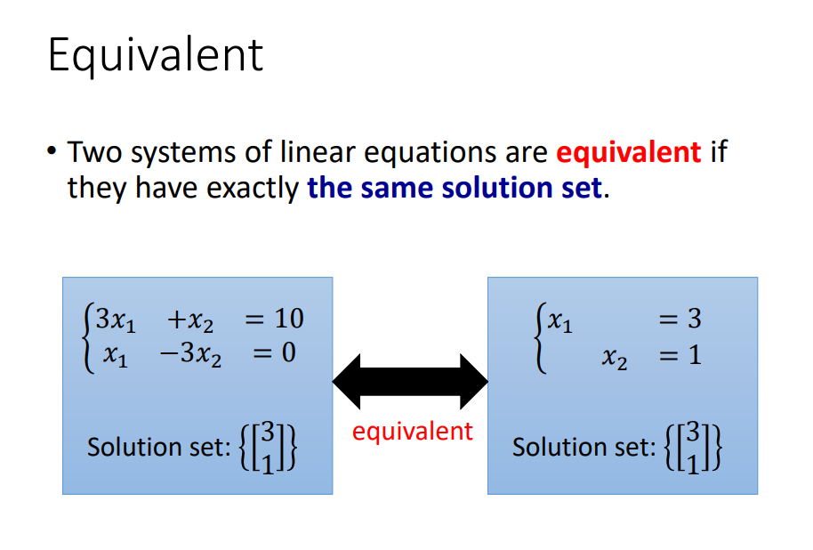

我们今天要学的内容是如何来解linear equation，我们要先知道一个概念是equivalent，如果两个linear equation有同样的解，那我们就说这两个linear equation是等价的。

假设有两个linear equation`$\left\{\begin{matrix}
3x_1+x_2=10\\ 
x_1-3x_2=0
\end{matrix}\right.$`，它的解是`$\begin{bmatrix}
3\\ 
1
\end{bmatrix}$`，另外的两个linear equation为`$\left\{\begin{matrix}
x_1=3\\ 
x_2=1
\end{matrix}\right.$`，它的也解为`$\begin{bmatrix}
3\\ 
1
\end{bmatrix}$`。这个linear equation虽然不相同，但是是等价的。

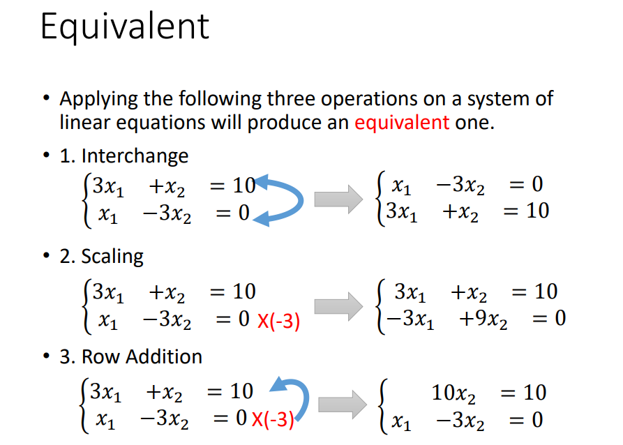

我们若将一些linear equation做某些operations以后变为另外一个等价的linear equation，有下面的三种操作：第一个操作(Interchange)是将equation进行交换(`$\left\{\begin{matrix}
3x_1+x_2=10\\ 
x_1-3x_2=0
\end{matrix}\right.\Rightarrow \left\{\begin{matrix}
x_1-3x_2=0\\ 
3x_1+x_2=10
\end{matrix}\right.$`)；第二个操作(Scaling)是将其中的某一个equation乘以任何的scalar(将每一个coefficients变为原来的n倍)(`$\left\{\begin{matrix}
3x_1+x_2=10\\ 
x_1-3x_2=0
\end{matrix}\right.\Rightarrow \left\{\begin{matrix}
3x_1+x_2=10\\ 
-3x_1+9x_2=0
\end{matrix}\right.$`)，不会影响最后的solution；第三个操作(Row Addition)是将某一个equation乘以n倍再加给另外一个equation(`$\left\{\begin{matrix}
3x_1+x_2=10\\ 
x_1-3x_2=0
\end{matrix}\right.\Rightarrow \left\{\begin{matrix}
10x_2=10\\ 
x_1-3x_2=0
\end{matrix}\right.$`)，不会影响最后的solution。

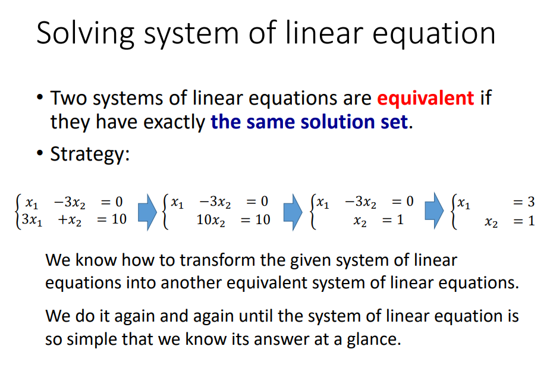

今天我们要解一个linear equation的策略就是：对给定的linear equation不断进行上一张投影片所讲的内容，直到它变为特别简单的linear equation。

假设有linear equations为`$\left\{\begin{matrix}
x_1-3x_2=0\\ 
3x_1+x_2=10
\end{matrix}\right.$`，使用Row Addition变为`$\left\{\begin{matrix}
x_1-3x_2=0\\ 
10x_2=10
\end{matrix}\right.$`，变为`$\left\{\begin{matrix}
x_1-3x_2=0\\ 
x_2=1
\end{matrix}\right.$`，变为`$\left\{\begin{matrix}
x_1=3\\ 
x_2=1
\end{matrix}\right.$`

高斯消去法的策略就是不断进行不会影响solution的operations，直到linear equation变为一秒就可以看出答案为止。

## 增广矩阵

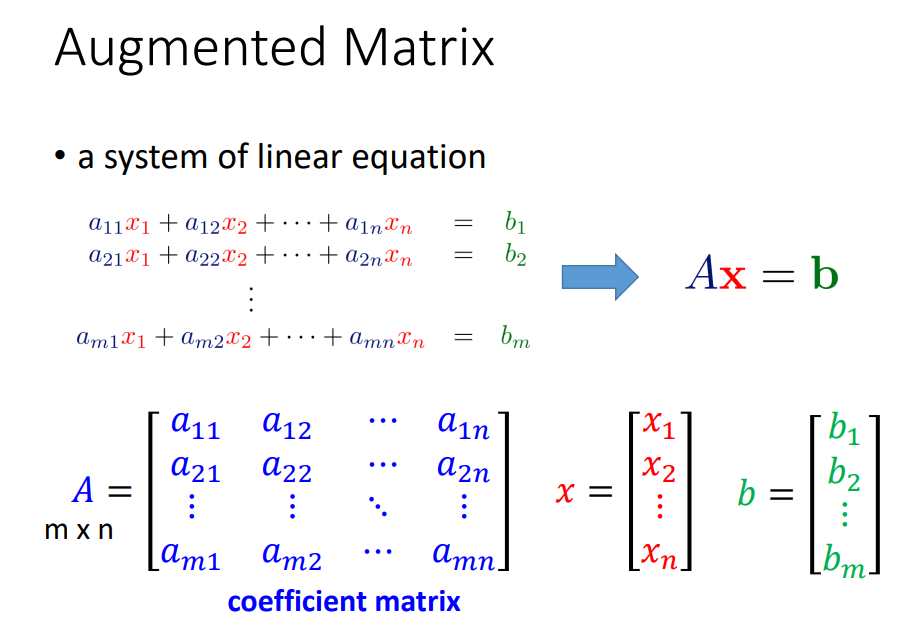

我们刚才举的例子是二元的联立方程式，我们通常解的是多元的联立方程式。我们可以将linear equation的coefficients可以用matrix来进行表示，未知数可以用向量**x**来表示，等号右边的constant也可以用向量**b**来进行表示。我们可以写作为`$Ax=b$`

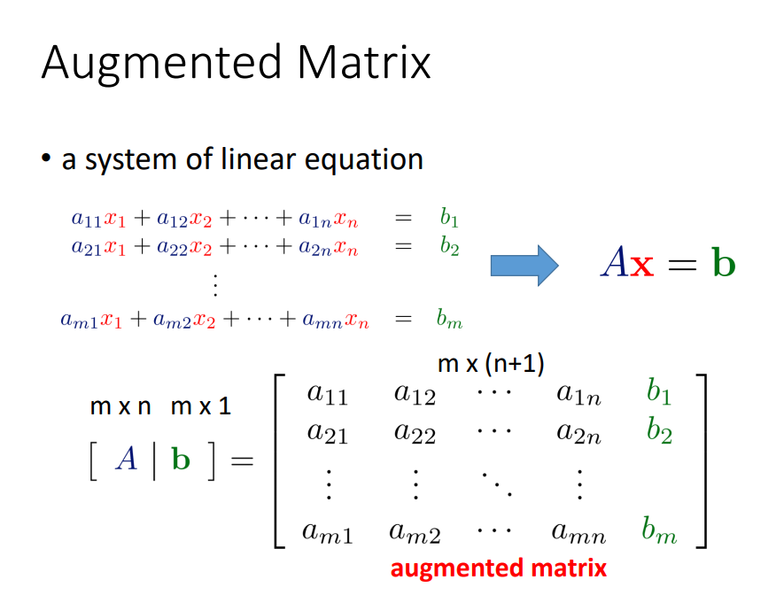

另外的一个表示方法是augmented matrix(不是用矩阵和向量相乘来进行表示)，将所有的coefficients和constant摆在一起，就是augmented matrix，如图所示的augmented matrix为`$m*(n+1)$`的矩阵。

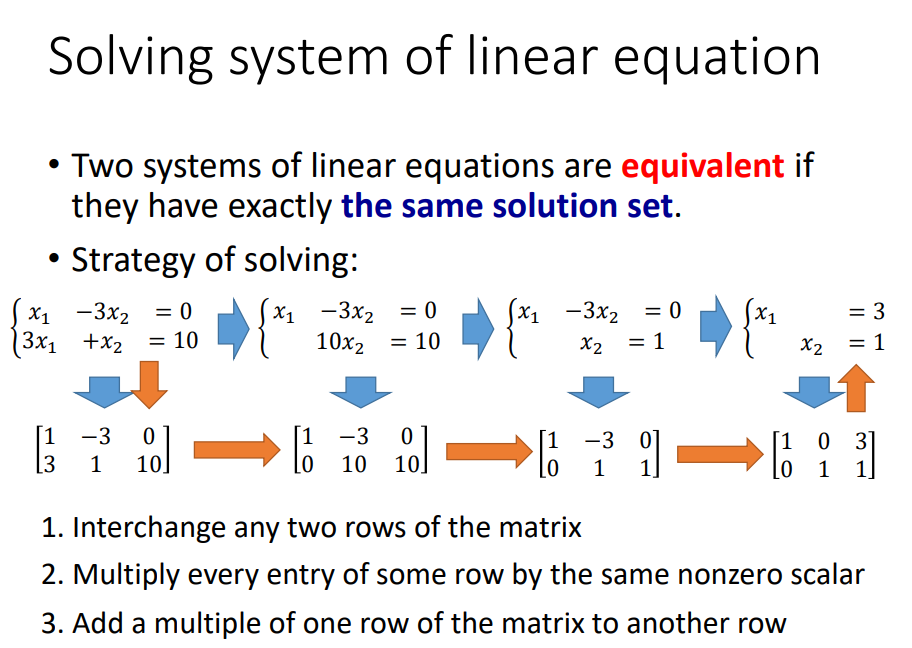

我们实际对linear equation进行变换的时候不会将等号和x写出来，因为这是很麻烦的（`$\left\{\begin{matrix}
x_1-3x_2=0\\ 
3x_1+x_2=10
\end{matrix}\right.$`），我们实际上是augmented matrix上进行操作，每一个linear equation都对应一个augmented matrix（`$\begin{bmatrix}
1 &-3  &0 \\ 
3 & 1 & 10
\end{bmatrix}$`）。

## RREF

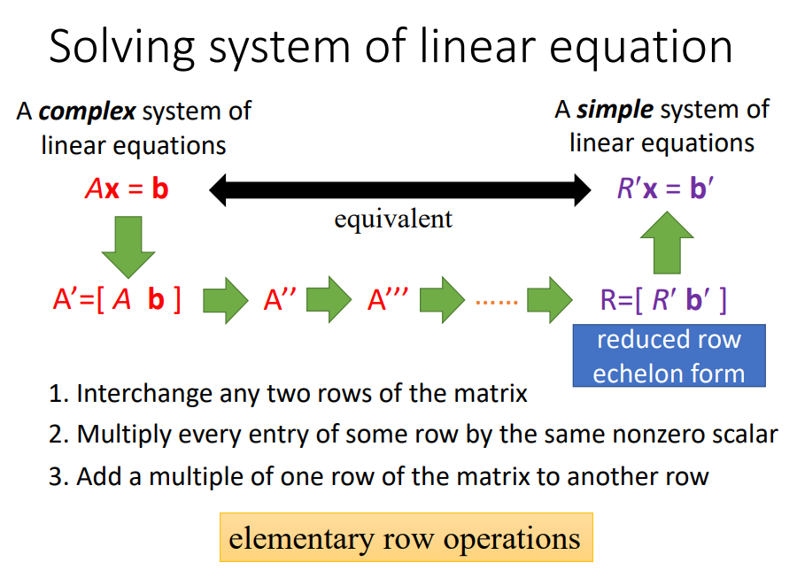

若有一个很复杂linear equation（`$Ax=b$`），它的augmented matrix `$A'$`为，接下来做以下三个操作，就可以将原来的`$A'$`变为`$A''$`，依次类推。直到它变为一个非常简单的形式（`$R=[R'b']$`），然后反推回linear equation（`$A'x=b'$`）

augmented matrix经历的三个操作（Interchange，Scaling，Row Addition）称为elementary row operations，上述描述的最简单的matrix（`$R=[R'b']$`）可以让我们一眼看出linear equation对应的solution是什么，这个matrix称为reduced row echelon form（RREF）

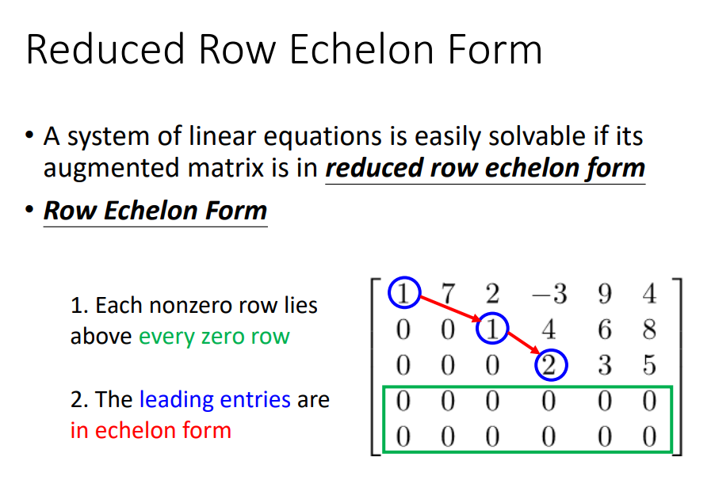

我们在讲reduced row echelon form，先搞明白row echelon form是什么。一个matrix我们说它是row echelon form时，它会满足以下两个性质：第一个性质是，所有的nonzero的row都在zero的row上面（若matrix里面有全为0的row，一定要摆在matrix的最底下）。第二个性质是，将所有的row的leading entries取出来（leading entries表示为：从左向右看，第一个不为0的element是leading entries），发现leading entries排成echelon form（如果leading entries排成像阶梯的形状，那么它就是echelon form，换句话说就是每一个leading entries都是在前一个leading entries的右下角）

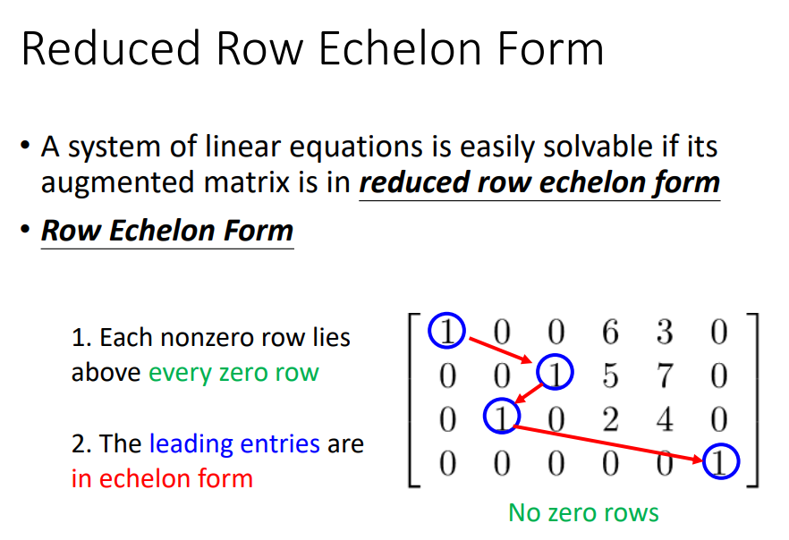

假设有一个matrix`$\begin{bmatrix}
 1&0  &0  &6  & 3 &0 \\ 
 0& 0 & 1 & 5 &7  &0 \\ 
 0&  1& 0 & 2 & 4 &0 \\ 
 0&  0&  0& 0 & 0 & 1
\end{bmatrix}$`，通过观察这个matrix满足第一个性质（没有nonzero row）。接下来我们将这个matrix里的leading entries圈出来，发现在这些leading entries里第三个row 的leading entries不是在第二个leading entries的右下方，这个matrix不满足第二条性质，所以这个matrix不是row echelon form。

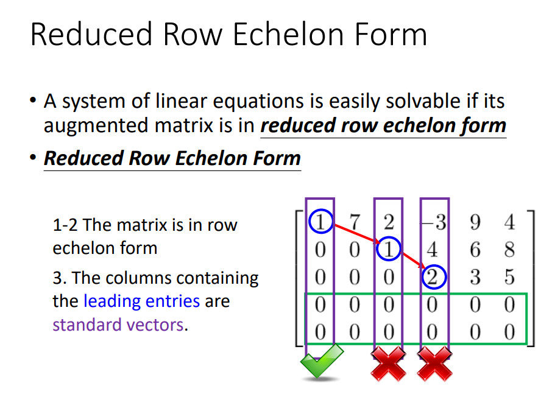

接下来要讲的内容是reduce row echelon form，reduce row echelon form满足的第一个和第二个条件为echelon form，第三个条件为leading entries所在的那个columns必须为standard vectors（standard vector表示其中只有一维是1，其他都为0（第一个column是standard vector；第二个leading entries在第三个column，但是第三个column不是standard vector；第三个leading entries在第四个column，但是第四个column不是standard vector）），所以这个matrix不是reduced rowechelon form。

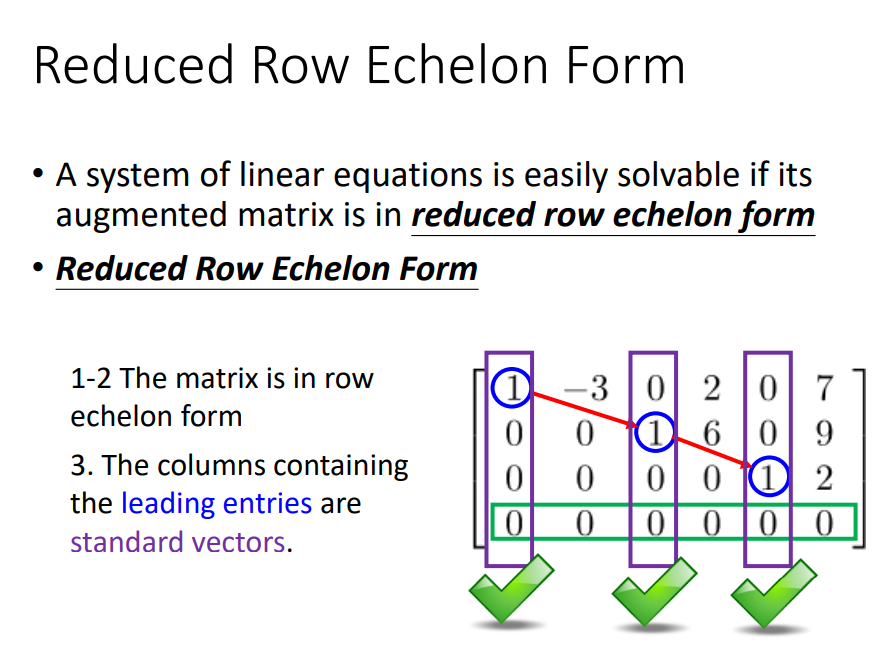

假设现在有一个matrix`$\begin{bmatrix}
 1&-3 &0  &2  & 0 &7 \\ 
 0& 0 & 1 & 6 &0  &9 \\ 
 0&  0& 0 & 0 & 1 &2 \\ 
 0&  0&  0& 0 & 0 & 1
\end{bmatrix}$`，若现在判断这个matrix是不是为reduced row echelon from，先用判断这个matrix是不是row echelon form。row echelon from的一个条件为，zero的row是不是在最下面，显然这个matrix是满足的；第二个条件为，每一个leading entries都是在前一个leading entries的右下角，显然这个matrix也是满足的。我们通过观察这个matrix的leading entries在standard vector里面，所以这个matrix是reduced row echelon from。

### 性质

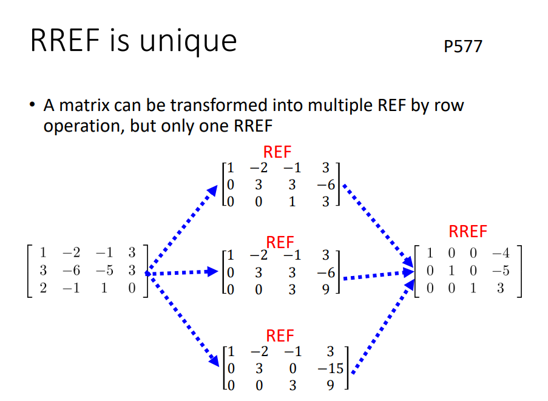

reduced row echelon from有一个重要的性质：每一个matrix对应一个RREF(RREF is unique)。将一个matrix进行row operation变为reduced row echelon from，不管row operation的操作顺序是如何，不管用了哪些row operation的操作，最终一个matrix的reduced row echelon from是相同的。但是row echelon form可能会有很多的不相同。

假设现有一个matrix`$\begin{bmatrix}
1 &-2  &-1  &3 \\ 
 3& -6 & -5 &3 \\ 
2 & -1 & 1 & 0
\end{bmatrix}$`，这个matrix通过row operation变为row echelon form（`$\begin{bmatrix}
1 &-2  &-1  &3 \\ 
0& 3 & 3 &-6 \\ 
0 & 0 & 1 & 3
\end{bmatrix}$`），但是row echelon form不只是有一个，我们可以再做一些row operation变为`$\begin{bmatrix}
1 &-2  &-1  &3 \\ 
0& 3 & 3 &-6 \\ 
0 & 0 & 3 & 9
\end{bmatrix}$`（将第三个row乘以3）；我们可以再做一些row operation变为`$\begin{bmatrix}
1 &-2  &-1  &3 \\ 
0& 3 & 0 &-15 \\ 
0 & 0 & 3 & 9
\end{bmatrix}$`（将第三个row乘以-1，加到第二个row），所以一个matrix有很多的row echelon form。但是reduced row echelon 只有唯一的。

现在假设matrix A为`$\begin{bmatrix}
 1& 2 &-1  & 2 &1  &2 \\ 
-1 &-2  &  1& 2 &3  &6 \\ 
2 & 4 & -3 & 2 &  0&3 \\ 
-3 & -6 & 2 & 0 & 3 &9 
\end{bmatrix}$`变为reduced row echelon form（`$\begin{bmatrix}
 1& 2 &0  & 0 &-1  &-5 \\ 
0 &0  &  1& 0 &0  &-3 \\ 
0 & 0 & 0 & 1 &  1&2 \\ 
0 & 0 & 0 & 0 & 0 &0 
\end{bmatrix}$`）。如果我们找出reduced row echelon form里面的leading entry的位置（(1, 1), (2, 3), (3, 4)），将这些位置对应到原来matrix的位置上。这些位置被称为pivot positions，pivot positions所在的column称为pivot columns。

### RREF的解

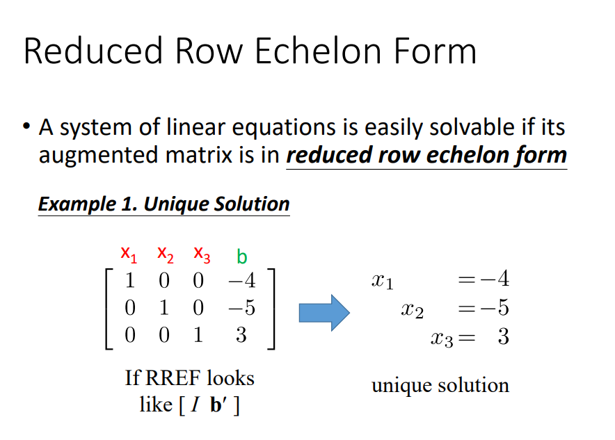

接下来要讲的内容是给定一个reduced row echelon form，咋样看出它的solution。

Unique Solution：给定一个reduced row echelon form`$\begin{bmatrix}
1 &0  &0  &-4 \\ 
0 & 1 &0  &-5 \\ 
1 & 0 &1  & 3
\end{bmatrix}$`，将它转回linear equation，然后它的解很容易就可以看出`$\left\{\begin{matrix}
x_1=-4\\ 
x_2=-5\\ 
x_3=3
\end{matrix}\right.$`。从这个示例中得到的结论为：如果reduced row echelon form去掉最后一个column以后，就变为一个identity matrix（斜对角的element为1，其它为0）表示就是有唯一解。

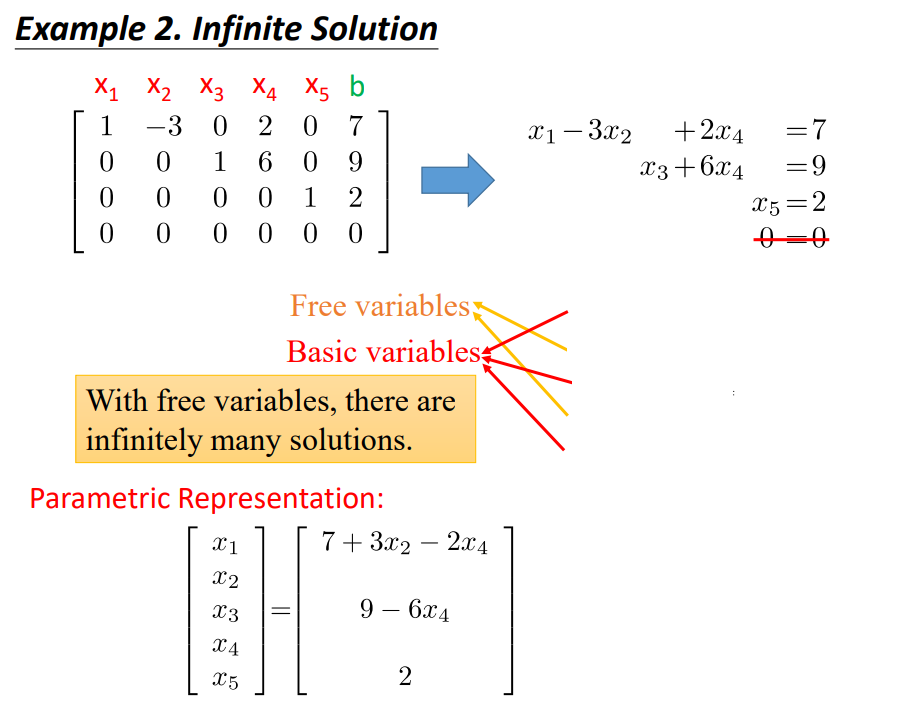

给定一个reduced row echelon form`$\begin{bmatrix}
1 & -1 &0  &2  &0  &7 \\ 
0 &0  & 1 & 6 & 0 &9 \\ 
0 &0  & 0 & 0 & 1 &2 \\ 
0 &0  & 0 & 0 & 0 &0 
\end{bmatrix}$`，将它还原为linear equation
变为`$\begin{bmatrix}
x_1-3x_2+2x_4=7\\ 
x_3+6x_4=9\\ 
x_5=2\\ 
0=0
\end{bmatrix}$`。除以`$x_5=2$`无法确定其它的variable数值等于多少，经变化为`$x_3=9-6x_4，x_1=7+3x_2-2x_4$`。我们将`$x_2, x_4$`称为Free variables，称`$x_1, x_3, x_5$`为Basic variables。根据上述式子`$\left\{\begin{matrix}
x_1=7+3x_2-2x_4\\ 
x_2 ,free\\ 
x_3=9-6x_4\\ 
x_4, free\\ 
x_5=2
\end{matrix}\right.$`可以写出parametric Representation。如果我们在linear equation 有Free variables时，就代表有无穷多解(不同的`$x_2, x_4$`就有不同的`$x_1, x_3$`)。将上述的式子描述为parametric Representation为`$\begin{bmatrix}
x_1\\ 
x_2\\ 
x_3\\ 
x_4\\ 
x_5
\end{bmatrix}=\begin{bmatrix}
7+3x_2-2x_4\\ 
x_2\\ 
9-6x_4\\ 
x_4\\ 
2
\end{bmatrix}=\begin{bmatrix}
7\\ 
0\\ 
9\\ 
0\\ 
2
\end{bmatrix}+x_2\begin{bmatrix}
3\\ 
1\\ 
0\\ 
0\\ 
0
\end{bmatrix}+x_4\begin{bmatrix}
-2\\ 
0\\ 
-6\\ 
1\\ 
0
\end{bmatrix}$`

假设有一个reduced row echelon form为`$\begin{bmatrix}
1 &0  &-3  &0 \\ 
0 &1  & 2 &0 \\ 
0 &0 & 0 &1 \\ 
0 &0  &0  &0 
\end{bmatrix}$`，然后将它还原为linear equation`$\left\{\begin{matrix}
x_1-3x_3=0\\ 
x_2+2x_3=0\\ 
0x_1+0x_2+0x_3=1\\ 
0x_1+0x_2+0x_3=0
\end{matrix}\right.$`，这时候发现第三个row为`$0x_1+0x_2+0x_3=1$`，这显然是不成立，所以这个linear equation 是无解的。

若发现某一个row只有最后一维非0，那这个linear equation就是inconsistent

## 高斯消去原则

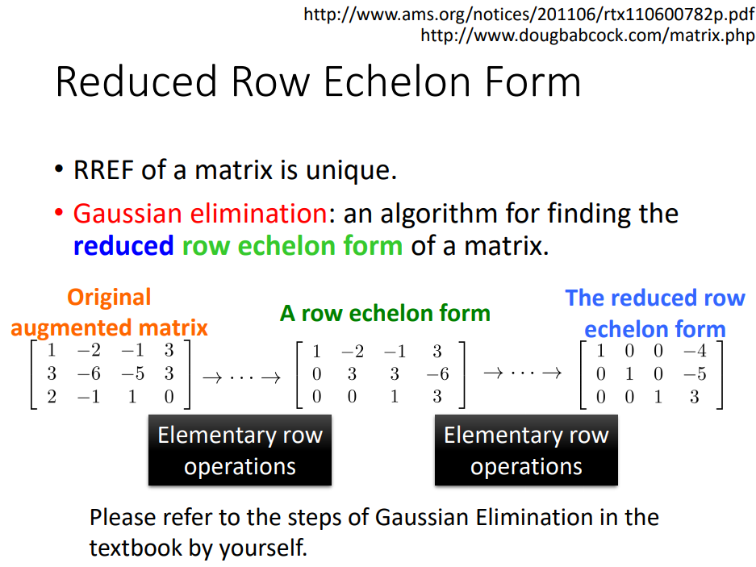

整个高斯消去法的大原则为：将原来的augmented matrix做一连串的elementary row operations变成row echelon form，在做一连串的elementary row operations变成reduced row echelon form

